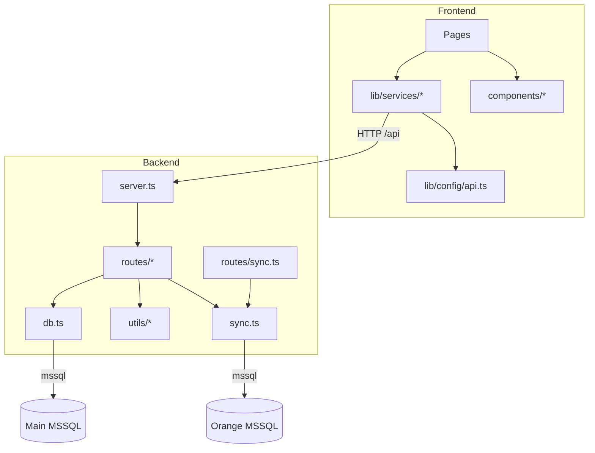

# Architecture

## Goals and Domain Model (Inferred)

- Provide attendance reporting and schedule visibility for employees.
- Sync schedule data from an external “Orange” system into the main application database.
- Provide an admin UI for managing users and operational parameters (sync scheduler, thresholds, etc.).

## Components

### Web UI (Vite + React)

- Source: [src](file:///c:/Scripts/Projects/time-keeper-pro/src)
- Responsible for:
  - Rendering dashboards and report tables.
  - Calling backend endpoints through an `/api` base (relative by default).
  - Handling “admin” navigation and local auth gating.

### Backend API (Express + TypeScript)

- Source: [backend](file:///c:/Scripts/Projects/time-keeper-pro/backend)
- Responsible for:
  - Exposing `/api/*` endpoints for scheduling, attendance reporting, sync status/control, user management, and authentication.
  - Connecting to MSSQL via the `mssql` driver.
  - Running an in-process sync scheduler (periodic schedule sync + log persistence).

### External Services

- Main MSSQL database: application data (MTIUsers, schedule history, sync logs/settings, users table, etc.)
- Orange MSSQL database: schedule source for the sync job.
- DataDB MSSQL database: optional additional data source used by some scripts.
- LDAP/AD server: optional authentication and AD user search/import.

## Request/Response Flows

### Frontend → Backend

- The frontend builds URLs with [buildApiUrl](file:///c:/Scripts/Projects/time-keeper-pro/src/lib/config/api.ts#L8-L14).
  - Default behavior: call `/api/...` relative to the current origin.
  - Optional behavior: call an explicit backend origin via `VITE_BACKEND_URL`.
- Vite dev proxy routes `/api` to the backend (see [vite.config.ts](file:///c:/Scripts/Projects/time-keeper-pro/vite.config.ts)).

### Backend → MSSQL

- Each request handler obtains a pooled connection through [getPool](file:///c:/Scripts/Projects/time-keeper-pro/backend/db.ts#L6-L11) (and similar functions for other DBs).
- Most endpoints use parameterized queries (`request.input(...)`) for safe binding.
- A few endpoints use schema introspection to locate the right columns at runtime when table schemas differ between environments:
  - [getTableColumns](file:///c:/Scripts/Projects/time-keeper-pro/backend/utils/introspection.ts#L4-L29) drives “find the best matching column name” logic in attendance and controller endpoints.

## Module Layout

```text
repo/
  src/                      # React web UI
    pages/                  # Public pages
    pages/admin/            # Admin pages
    components/             # Layout + shadcn-ui + DB tables
    lib/
      config/api.ts         # API base URL builder
      services/             # fetch wrappers + Zustand store
  backend/                  # Express API + sync/schemas/scripts
    routes/                 # Express routers mounted under /api/*
    utils/                  # formatting + schema introspection
    scripts/                # schema apply and other operational scripts
    schema/                 # SQL DDL files
```

## Dependency Relationships (Logical)



## Deployment Topology

- Local dev: `npm run dev:full` starts the frontend and backend processes on the host.
- Docker: [docker-compose.yml](file:///c:/Scripts/Projects/time-keeper-pro/docker-compose.yml) runs `web` and `backend` containers; the DB remains external and is configured via `.env`.

